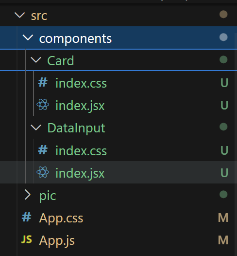
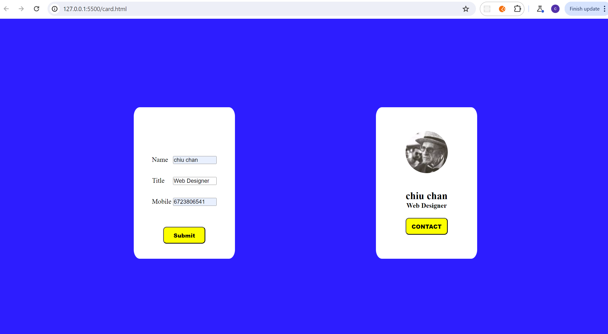
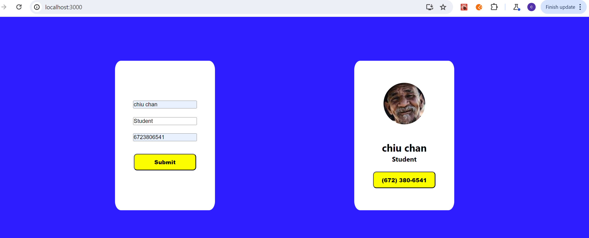

# Rewrite by React framwork 

# create project and install pubsub-js(for transfer data between Components)

```
npx create-react-app function-react
cd function-react
npm i pubsub-js 
```

# skills
```
  state
  React.createRef() 
  pubsub-sj

```

# create componets




# translate the html code to React components.


# publish and subscribe message

publish message in compoent  DataInput and subscribe message in componet Card.


# Layout


# input arguments for the function and click Submit Button


 

# press the CONTACT Button and show the formatted number.

 

# code App.js

```
// import logo from './logo.svg';
import React, { Component } from 'react'

import DataInput from './components/DataInput';
import Card from './components/Card';

import './App.css';

export default class App extends Component {
  render() {
    return (
      <div className="page">
            
          <DataInput />
          <Card />
  </div>
    )
  }
}


```

# code component DataInput

```
import React, { Component } from 'react'
import PubSub from 'pubsub-js'
import './index.css'

export default class DataInput extends Component {

    nameRef = React.createRef()
    titleRef = React.createRef()
    mobileRef = React.createRef()

    publishMsg = () => {
        // const dataInputs = document.getElementsByTagName('input')
        // console.log(this.nameRef)
        const dataObject = {name: this.nameRef.current.value,
                           title: this.titleRef.current.value,
                           mobile: this.mobileRef.current.value.replace(/(\d{3})(\d{3})(\d+)/g, "($1) $2-$3")
                           }
            
        PubSub.publish('dataInput',dataObject)

         
    } 
  render() {
    return (
        <div className="dataInput">
             
                 
            <input type="text" ref={this.nameRef} id="name" placeholder="Enter your name" />

            <input type="text" ref={this.titleRef} className="title" id="title" placeholder="Enter your title" />

            <input type="text" ref={this.mobileRef} className="mobile" id="mobile" placeholder="Enter your phone number" />
                
            <button id="dataSubmit" onClick={this.publishMsg}>Submit</button>

        </div>
    )
  }
}


```

# code component Card

```
import React, { Component } from 'react'
import PubSub from 'pubsub-js'
import './index.css'

export default class Card extends Component {
    state = {dataInput:{name: '',
                        title: '',
                        mobile: ''
    }}

    showNumber = (e) => {
        e.target.innerHTML = this.state.dataInput.mobile
        // console.log(e)
        // this.setState()
    }

    componentDidMount() { 
        PubSub.subscribe('dataInput',(msg,dataInput) => {
            // console.log(data)
            this.setState({dataInput})
        })
     }
  render() { 
    return (
        <div className="card">
            
            <div className="content">
                <h2 id="cardName">{this.state.dataInput.name || 'name'}</h2>
                <h4 className="title" id="cardTitle">{this.state.dataInput.title || 'title'}</h4>
                {/* <h4 id="cardMobile"></h4> */}
            </div>
            <button id="contact" onClick={this.showNumber} >CONTACT</button>
        </div>
    )
  }
}

```